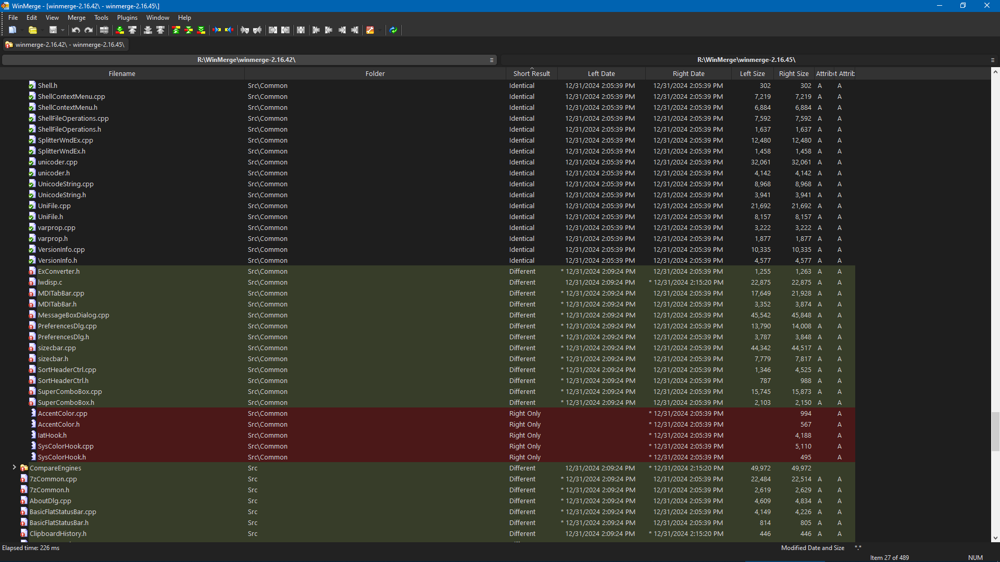
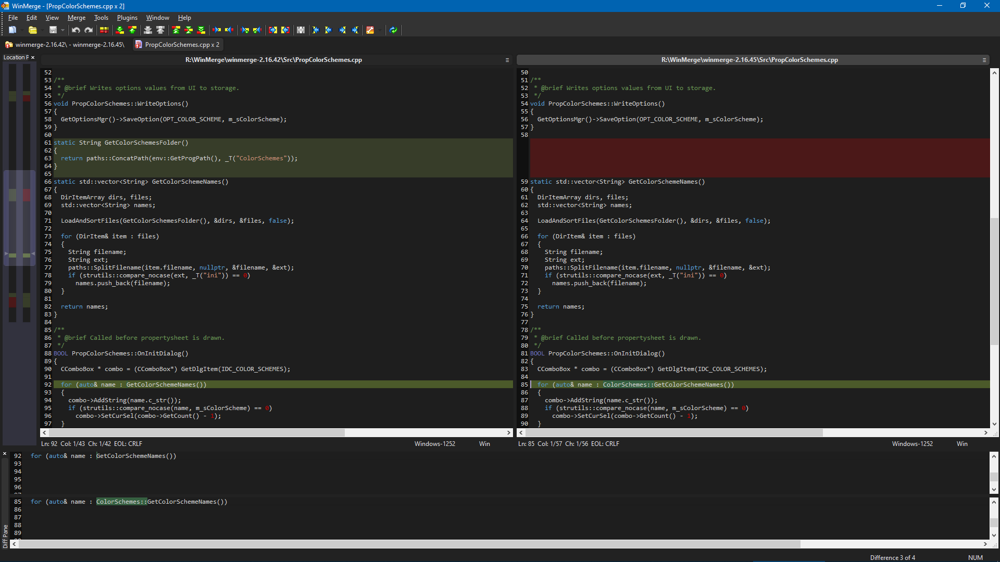

# Visual Studio Dark theme for WinMerge
A [WinMerge](https://winmerge.org/) Color Scheme inspired by the Visual Studio Dark theme for vscode.

> IMPORTANT:  Please update WinMerge to version **2.16.44** or newer for best color support.

## Installation
- Copy `Visual Studio Dark.ini` into the `ColorSchemes` folder wherever you have WinMerge installed.
- Open WinMerge Options, go to `Color Schemes`, and select `Visual Studio Dark`

## References
- [WinMerge github](https://github.com/WinMerge/winmerge)

## Screenshots

### Directory Compare

### File Compare

